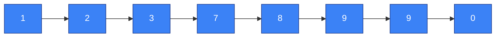
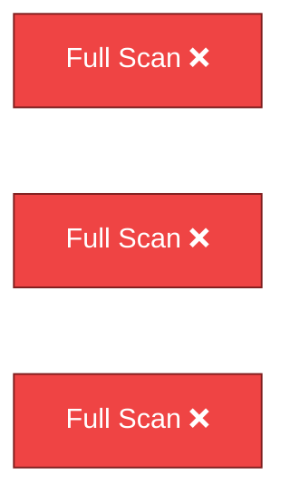
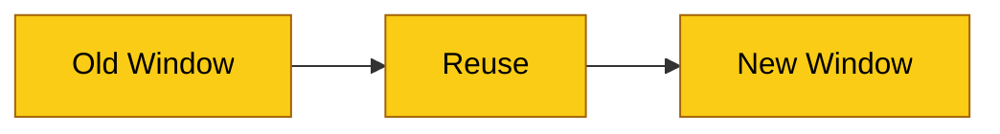
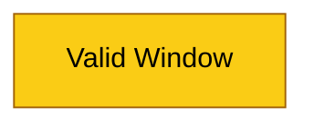
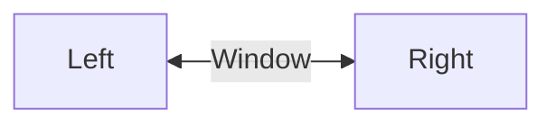

# Sliding Window Diagrams

---

## Diagram 1 — Array (T = 0s)



## Diagram 2 — Window shows small part (T = 3s)


## Diagram 3 — No repeated full scans (T = 6s)



## Diagram 4 — Window moves right (T = 9s)

```mermaid
flowchart LR
    A1[ ] --> A2[ ] --> A3[ ] --> A4[ ] --> A5[ ] --> A6[ ] --> A7[ ] --> A8[ ]

    Move --> 

    classDef base fill:#3b82f6,stroke:#1e3a8a,color:#ffffff;
    classDef window fill:#facc15,stroke:#a16207,color:#000000;

    class A2,A3 window;
    class A1,A4,A5,A6,A7,A8 base;
```

## Diagram 5 — Expand window (T = 12s)


## Diagram 6 — Shrink window (T = 15s)


## Diagram 7 — Reuse overlap (T = 18s)



## Diagram 8 — Valid window (T = 21s)


## Diagram 9 — Adjust window (T = 24s)



## Diagram 10 — Final idea (T = 27s)


