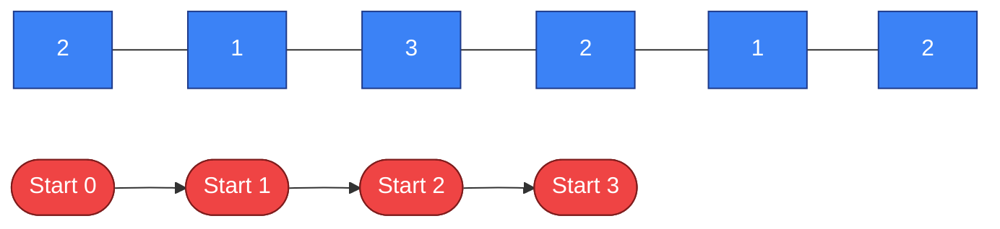
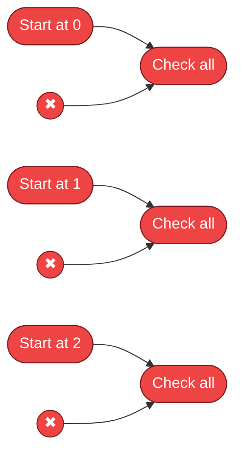
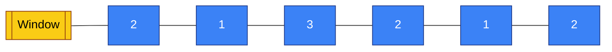
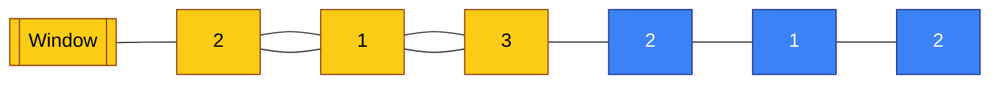
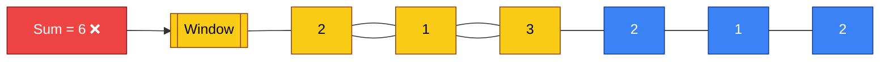
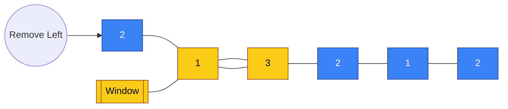
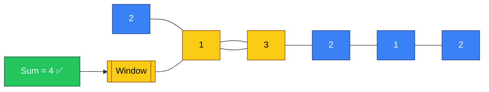
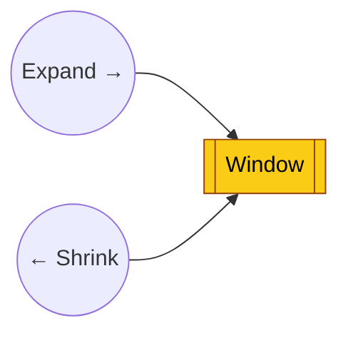
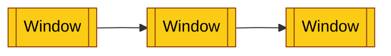

# Sliding Window

---

## Diagram 1 — (0s: Array Introduction)

“Imagine a moving window on an array”

---

## Diagram 2 — (3s: Many Subarrays = Problem)

“Why do we need this?”

---

## Diagram 3 — (6s: Goal)

“We want the longest part with sum ≤ 5”

---

## Diagram 4 — (9s: Brute Force = Repetition)

“Basic way repeats work again and again”

---

## Diagram 5 — (12s: Introduce Window)

“So we use a window”

---

## Diagram 6 — (15s: Expand Window)

“We expand to include more elements”

---

## Diagram 7 — (18s: Condition Breaks)

“Now sum becomes more than 5”

---

## Diagram 8 — (21s: Shrink from Left)

“So we shrink from the left”

---

## Diagram 9 — (24s: Valid Again)

“Now it becomes valid again”

---

## Diagram 10 — (27s: Expand + Shrink)

“Expand… then shrink if needed”

---

## Diagram 11 — (30s: Keep Moving Forward)

“We don’t restart… we adjust”

